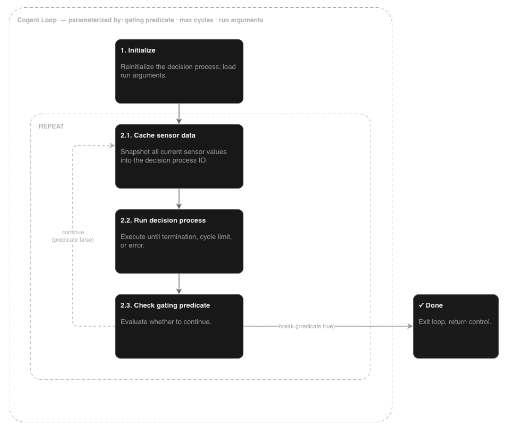

# (Cog)nitive Ag(ent) -> Cogent

A `Cogent` provides a Perceive-Decide-Act loop by integrating...
* A supplied `DecisionProcess`
* Any number of supplied `Sensor` objects
* Any number of supplied `Actuator` objects

:::{note}
Each `Sensor`/`Actuator` has a name, which indicates the path within the `IOContainer` (`io.i.sensor_name` or `io.o.actuator_name`).
:::

:::{tip}
To help avoid mistakes in addressing io information, each `Sensor` can supply a *reader* to pull information from the named location within the `IOContainer` (and similarly each `Actuator` can provide an `invoker`).
:::
