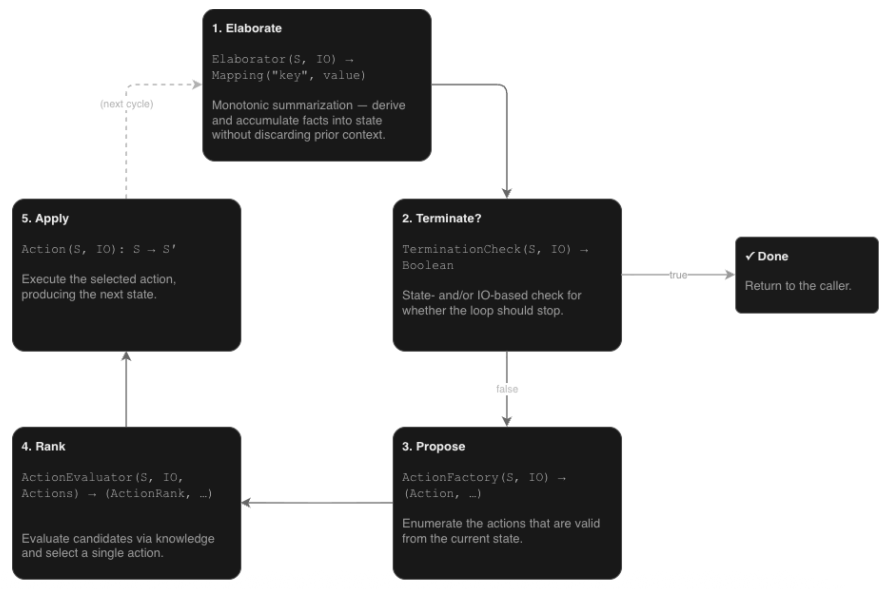

# Knowledge-Augmented Decision Process (KADP)

> **Agentic AI Equivalent:**
>**Orchestration** (see [GitHub's guide on AI Orchestration](https://github.com/resources/articles/what-is-ai-orchestration)).
> In agentic systems, an orchestration engine manages sequential decision-making.

## What is a Decision Process?
A decision process is a **declarative, state-driven execution machine** that continually matches a state against a collection of independent operators to determine the next step.

Key characteristics include:
* **Iterative Execution:** Instead of executing code along a fixed, linear path, a decision process runs an iterative loop on every system tick.
* **Declarative Control:** Rather than hardcoding an explicit, rigid sequence of steps in a workflow, developers define *decision criteria* declaratively.
* **State Mutation:** They continually evaluate agent state to determine the next steps of reasoning or action. Each chosen action mutates the state, leading directly to the next decision.
* **Hierarchical Structure:** Decision processes can be organized hierarchically to manage complex system architectures.

`cognition` uses `DecisionProcess` to continuously evaluate declarative decision criteria against a live state, dynamically computing, executing, and adjusting workflows in real-time. This conceptualization is similar in spirit to a combination of event-driven and data-driven programming paradigms, but they are purpose-built for agentic systems.

## What are the Scientific Principles?
A knowledge-Augmented `DecisionProcess` (KADP) shares identical concepts of states and actions with MDPs but replaces data-driven, trial-and-error reinforcement learning with explicitly programmed expert domain knowledge. Rather than relying on environment simulators, reward functions, discount factors, or probabilistic state transitions, KADP uses deterministic programmatic operators, preconditions, and termination checks. This design bypasses the cold-start problem of reinforcement learning, enabling predictable, auditable, and expert-driven decision-making from the very first step.

## Why Use a Decision Process?
Using a decision process for orchestration provides an ideal middle ground between deterministic code and non-deterministic AI generation. It fundamentally **balances the need for flexible process execution with the controllability of the process.**

* **Context-Aware Flexibility:** It behaves with the flexibility of an LLM-driven orchestration, using a live state to dynamically figure out what to do next.
* **Guaranteed Execution:** Unlike LLMs (which can deviate from instructions), a decision process is written programmatically, guaranteeing exactly what steps and operators are executed in a given situation.

## Implementation Details
The **(Knowledge Augmented) Decision Process**, or **(KA)DP**, operates on a continuous cycle of evaluating state and executing actions:



### Core Components
* **`state`**: Defines the mutable data needed to represent process progress. Upon initialization of the DP, you provide a function to supply its initial state.
* **`IOContainer`**: Provides the process with access to non-state data and channels.
  * **`input` (`i`)**: Read-only structured data (typically from external sensors).
  * **`output` (`o`)**: Channels for execution (typically a function used to interact with external actuators).
  * **`elab` (`e`)**: Key/computed value pairs (typically combining aspects of state + input + arguments).
  * **`args` (`a`)**: Read-only key/value pairs used to parameterize an execution of the process.

:::{tip}
The string value (e.g., `str(my_dp)` of a DP reveals highly useful information about this structure.
:::

### The DP Cycle (Phases)
The DP continually executes a cycle consisting of the following phases:
1. **`Elaboration`** (via `Elaborator`): Computes value(s) based upon the current state and IO.
2. **`Termination`** (via `TerminationCheck`): Detects state-based ending conditions.
3. **`Propose`** (via `ActionFactory`): Indicates valid `Action`(s) that can be taken.
4. **`Rank`** (via `ActionEvaluator`, producing `ActionRank`): Uses knowledge to evaluate and score candidate actions.
5. **`Apply`** (commonly via operators): Executes the single selected action, typically to modify state and/or externally actuate.

:::{note}
A DP can `run` individual phases/cycles, but commonly runs until a termination condition is detected.

Once terminated, a DP must be `reinit`ialized before future runs, which restarts the cycle and resets the DP state to an initial value.
:::

:::{tip}
It is not uncommon for the state initialization function to return a reference to a (mutable) object...

```python
my_state = CustomStateClass()
my_dp = DecisionProcess(lambda: my_state)
```

The effect of this pattern is that DP state persists across DP `reinit`.
:::

### Useful DP-related Abstractions
While highly flexible, the `BaseDecisionProcess` can be cumbersome to use raw. The `DecisionProcess` subclass integrates common conveniences:

* **`NamedObject`**: An object with an informational read-only name and key/value parameters. Each `Operator` is a `NamedObject`.
* **`Operator`**: Combines proposal and application within a single context. Maps 1:1 from object/instance to a persistent action factory + action.
  * `can_perform`: A simple predicate indicating if the object applies in the current context.
  * `perform`: The action to perform if selected.
* **`OperatorGenerator`**: An operator factory that dynamically generates (per cycle) only those instances that apply (obviating the need for `can_perform`), and specifies the `perform` action.

:::{note}
Each `Operator` is a `NamedObject` (which can be useful for identification/categorization).
:::

:::{tip}
By default, a `DecisionProcess` will consider the application of an `Operator` with a `terminal` parameter to signal termination.
(This is analogous to terminal nodes within finite state machines.)
:::

* **`ActionEvaluator`**: Provides `ActionRank` objects that associate a proposed action with a value (smaller means more important).
  * `uniform_evaluator`: Provides the same value to any actions matching an optional predicate.
  * `sorting_evaluator`: Produces rankings by sorting the results of a key function applied to each proposed action.
  * `operator_sorting_key`: Builds a key function based on the `<` and `==` operators.

:::{note}
The DP will not invoke any evaluator if there is only a single proposed action.
:::

:::{note}
If multiple actions share the ranking of lowest value, the DP will randomly select from amongst them.
:::

### Useful DP-State-related Abstractions
* **`SelfReinitState`**: Implements `__call__` so that supplying an instance as a state initialization function enables custom reinitialization logic.
* `Elaborable` Protocol: If a DP state implements this, it receives a per-cycle callback for within-object elaboration.
  * `SelfElaborationState`: Provides easy access to a within-class key-value store of elaborated values.
* **`PTEState`**: Grants convenient access to (**P**)ersistent, (**T**)ransient [to DP `reinit`], and (**E**)laborated data within a single state object. 
  * `PEState` is a variant for when transient data isn't needed.
* **`create_chain_dp`**: Generates a DP based on an iterable state type, calling a supplied function at each *link* in the *chain* (optionally supporting the accumulator pattern).
* **`StagedState`**: Represents states where transitions can be captured within a single `Enum` flag.
  * Flow and transition knowledge are held within the class using the `EnumDispatch` class, which dispatches to methods named identically to an enumerated value.
  * `staged_operator`: A decorator for a `perform` function, used since DP operators then only need to check the current flag value.

### Typical DP Usage (e.g., Isolated Testing)
1. **Design DP state:** (e.g., author a custom state class).
2. **Instantiate a DP:** Supply it with a function that outputs an initial state value.
3. **Add components:** (e.g., attach operators, termination checks, etc., to the DP).
4. **Run:** (e.g., via `my_dp()`).
5. **Access state & Repeat:** Access the DP state, potentially run `reinit` -> re-run.
